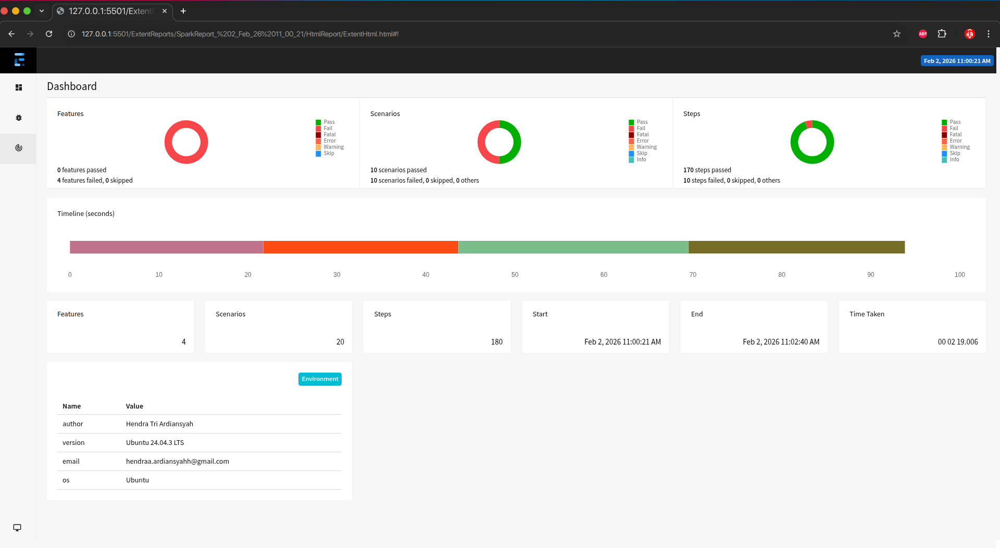
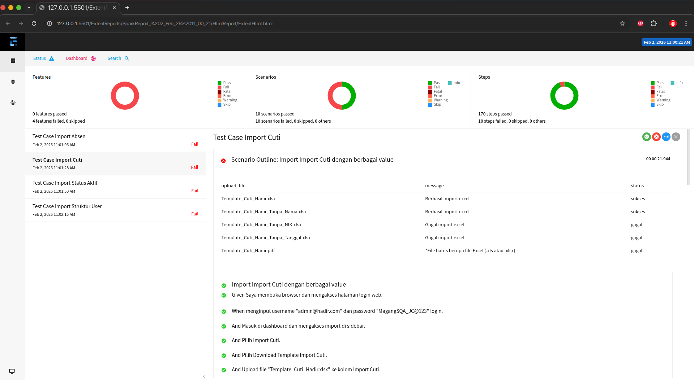

# Proyek Automasi Pengujian Import Hadir

Proyek ini adalah kerangka kerja automasi pengujian untuk aplikasi web, berfokus pada fungsionalitas impor data melalui file Excel. Dibuat menggunakan pendekatan Behavior-Driven Development (BDD) dan Page Object Model (POM) untuk memastikan kode yang mudah dirawat dan diskalakan.

## Struktur Proyek

Struktur direktori proyek ini diatur untuk memisahkan kode sumber aplikasi, pengujian, laporan, dan konfigurasi:

```
.
├── .github/                      # Konfigurasi GitHub Actions atau alur kerja CI/CD lainnya
├── ExtentReports/                # Direktori untuk menyimpan laporan hasil eksekusi tes (HTML, PDF, Screenshot)
├── src/
│   ├── main/
│   │   └── java/                 # Kode sumber aplikasi utama (jika ada)
│   │       └── com/juaracoding/App.java
│   └── test/
│       ├── java/                 # Kode sumber untuk pengujian
│       │   └── com/juaracoding/
│       │       ├── definition/   # Implementasi step-definition Cucumber
│       │       │   ├── ImportAbsenStepDefinition.java
│       │       │   ├── ImportCutiStepDefinition.java
│       │       │   ├── ImportStatusAktifStepDefinition.java
│       │       │   └── ImportStrukturUserStepDefinition.java
│       │       ├── hook/         # Kelas untuk mengelola siklus hidup tes (setup/teardown browser, screenshot)
│       │       │   └── Hook.java
│       │       ├── page/         # Implementasi Page Object Model
│       │       │   ├── BasePage.java
│       │       │   ├── DashboardPage.java
│       │       │   ├── ImportAbsen.java
│       │       │   ├── ImportCuti.java
│       │       │   ├── ImportStatusAktif.java
│       │       │   ├── ImportStrukturUser.java
│       │       │   ├── IPageComponent.java
│       │       │   ├── LoginPage.java
│       │       │   └── components/
│       │       │       ├── BaseComponent.java
│       │       │       └── SidebarComponent.java
│       │       ├── runner/       # Test runner untuk Cucumber/TestNG
│       │       │   └── RunnerTest.java
│       │       └── utils/        # Utility class (misal: DriverUtil untuk WebDriver)
│       │           ├── DriverUtil.java
│       │           └── ScreenshotUtil.java
│       └── resources/            # Sumber daya untuk pengujian
│           ├── cucumber.properties # Properti konfigurasi Cucumber
│           ├── extent.properties   # Properti konfigurasi ExtentReports
│           ├── testng.xml          # Konfigurasi TestNG
│           ├── data/             # File data tes (Excel)
│           │   ├── DATA_ABSEN_HADIR.xlsx
│           │   ├── DATA_STATUS_USER.xlsx
│           │   ├── DATA_STRUKTUR_USER.xlsx
│           │   └── Template_Cti_Hadir.xlsx
│           └── features/         # File Gherkin .feature (deskripsi skenario tes)
│               ├── ImportAbsen.feature
│               ├── ImportCuti.feature
│               ├── ImportStatusAktif.feature
│               └── ImportStrukturUser.feature
├── pom.xml                       # Konfigurasi proyek Maven
├── test-output/                  # Output sementara dari eksekusi tes (misal: hasil TestNG)
└── .gitignore                    # File untuk mengabaikan file/direktori tertentu oleh Git
```

## Test Cases

Semua skenario pengujian didefinisikan menggunakan Gherkin dalam file `.feature` yang terletak di `src/test/resources/features/`. Pendekatan BDD ini memungkinkan pemangku kepentingan non-teknis untuk memahami fungsionalitas yang diuji.

Saat ini, proyek ini mencakup pengujian untuk fungsionalitas impor data berikut:

*   **Import Absen (Absensi):** Menguji proses impor data absensi.
*   **Import Cuti (Cuti):** Menguji proses impor data cuti.
*   **Import Status Aktif (Status Pengguna Aktif):** Menguji proses impor status keaktifan pengguna.
*   **Import Struktur User (Struktur Pengguna):** Menguji proses impor data struktur organisasi atau pengguna.

Setiap fungsionalitas diuji dengan berbagai skenario, termasuk kasus sukses, kasus data kosong (blank), dan kasus data yang tidak lengkap (misal: tanpa header, tanpa nama, tanpa NIK, dll.), menggunakan file Excel sebagai data uji yang disimpan di `src/test/resources/data/`.

## Tech Stack

Proyek ini dibangun di atas tumpukan teknologi berikut:

*   **Bahasa Pemrograman:** Java
*   **Build Tool & Manajemen Dependensi:** Apache Maven
*   **Automasi Web:** Selenium WebDriver
*   **Framework BDD:** Cucumber
*   **Test Runner:** TestNG
*   **Pelaporan:** ExtentReports (untuk laporan HTML dan PDF yang kaya)
*   **Desain Pola:** Page Object Model (POM)

Kerangka kerja ini dirancang untuk menyediakan solusi pengujian automasi yang kuat dan dapat diandalkan untuk proses impor data.

## Contoh Laporan dan Screenshot

Berikut adalah beberapa contoh gambar dari dokumentasi dan laporan bug.

**Environment**


**Report**


**Screenshot Bug**


**Screenshot Sukses Test Case**
